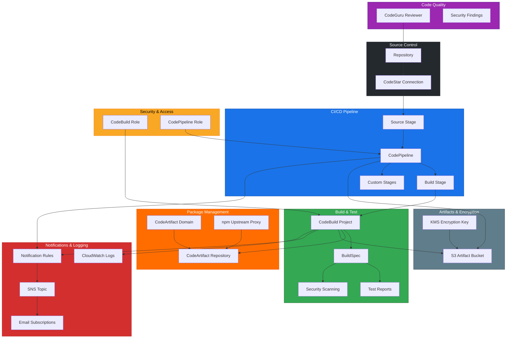

# terraform-aws-amazon-q-developer

AWS Amazon Q Developer infrastructure module providing an AI-powered code assistant platform with CI/CD pipeline integration, automated code reviews via CodeGuru Reviewer, security scanning, and package management through CodeArtifact. This module provisions a complete developer productivity platform on AWS.

## Architecture



## Documentation

- [Amazon Q Developer User Guide](https://docs.aws.amazon.com/amazonq/latest/qdeveloper-ug/what-is.html)
- [Amazon CodeGuru Reviewer](https://docs.aws.amazon.com/codeguru/latest/reviewer-ug/welcome.html)
- [Terraform aws_codebuild_project Resource](https://registry.terraform.io/providers/hashicorp/aws/latest/docs/resources/codebuild_project)
- [AWS CodePipeline User Guide](https://docs.aws.amazon.com/codepipeline/latest/userguide/welcome.html)
- [AWS CodeArtifact User Guide](https://docs.aws.amazon.com/codeartifact/latest/ug/welcome.html)
- [AWS CodeStar Connections](https://docs.aws.amazon.com/dtconsole/latest/userguide/connections.html)

## Prerequisites

- Terraform >= 1.5.0
- AWS Provider >= 5.40.0
- AWS CLI configured with appropriate credentials
- A source code repository on GitHub, GitLab, or Bitbucket
- IAM permissions to create CodeBuild, CodePipeline, S3, KMS, SNS, IAM roles, and related resources
- After deployment, the CodeStar Connection must be manually confirmed in the AWS Console (Settings > Connections)

## Deployment Guide

### Step 1: Configure Backend (Optional)

```hcl
terraform {
  backend "s3" {
    bucket         = "my-terraform-state"
    key            = "amazon-q-developer/terraform.tfstate"
    region         = "us-east-1"
    dynamodb_table = "terraform-locks"
    encrypt        = true
  }
}
```

### Step 2: Create Variable Definitions

Create a `terraform.tfvars` file:

```hcl
project_name     = "my-app"
repository_url   = "my-org/my-repo"
source_provider  = "GitHub"
branch_name      = "main"
build_compute_type = "BUILD_GENERAL1_MEDIUM"

enable_code_review       = true
enable_security_scanning = true

codeartifact_domain = "my-org-packages"

notification_emails = [
  "dev-team@company.com",
  "security@company.com"
]

tags = {
  Environment = "production"
  Team        = "engineering"
  ManagedBy   = "terraform"
}
```

### Step 3: Initialize and Apply

```bash
terraform init
terraform plan -out=tfplan
terraform apply tfplan
```

### Step 4: Complete the CodeStar Connection

After applying, the CodeStar Connection will be in `PENDING` status. Complete the handshake:

```bash
# Open the AWS Console and navigate to:
# Developer Tools > Settings > Connections
# Click on the pending connection and complete the authorization with your source provider
```

Alternatively, use the AWS CLI:

```bash
aws codestar-connections list-connections --provider-type GitHub
# Note the ConnectionArn, then complete in the Console
```

### Step 5: Trigger the Pipeline

```bash
# The pipeline will trigger automatically on the next push to the configured branch
# To trigger manually:
aws codepipeline start-pipeline-execution --name my-app
```

### Step 6: Verify Build and Review

```bash
# Check pipeline status
aws codepipeline get-pipeline-state --name my-app

# Check build logs
aws logs tail /aws/codebuild/my-app --follow

# Check CodeGuru findings (if enabled)
aws codeguru-reviewer list-recommendations --repository-name my-app
```

## Inputs

| Name | Description | Type | Default | Required |
|------|-------------|------|---------|----------|
| `project_name` | Name of the project, used as prefix for all resources | `string` | n/a | yes |
| `repository_url` | URL/ID of the source code repository (e.g., org/repo) | `string` | n/a | yes |
| `source_provider` | Source code provider (GitHub, GitLab, Bitbucket) | `string` | `"GitHub"` | no |
| `branch_name` | Branch name to build from | `string` | `"main"` | no |
| `build_compute_type` | CodeBuild compute type | `string` | `"BUILD_GENERAL1_MEDIUM"` | no |
| `build_image` | Docker image for CodeBuild environment | `string` | `"aws/codebuild/amazonlinux2-x86_64-standard:5.0"` | no |
| `enable_code_review` | Enable CodeGuru Reviewer for automated code reviews | `bool` | `true` | no |
| `enable_security_scanning` | Enable security scanning in the build pipeline | `bool` | `true` | no |
| `codeartifact_domain` | CodeArtifact domain name for package management | `string` | `""` | no |
| `pipeline_stages` | Additional pipeline stages beyond Source and Build | `list(object)` | `[]` | no |
| `notification_emails` | Email addresses for pipeline notifications | `list(string)` | `[]` | no |
| `encryption_key_arn` | ARN of existing KMS key (creates new if empty) | `string` | `""` | no |
| `tags` | Tags to apply to all resources | `map(string)` | `{}` | no |

## Outputs

| Name | Description |
|------|-------------|
| `codebuild_project_arn` | ARN of the CodeBuild project |
| `codepipeline_arn` | ARN of the CodePipeline |
| `codeartifact_domain_arn` | ARN of the CodeArtifact domain |
| `codeartifact_repository_arn` | ARN of the CodeArtifact repository |
| `codeguru_association_arn` | ARN of the CodeGuru Reviewer repository association |
| `s3_artifact_bucket` | Name of the S3 artifact bucket |
| `sns_topic_arn` | ARN of the SNS notification topic |
| `connection_arn` | ARN of the CodeStar source connection |

## Usage Example

```hcl
module "q_developer" {
  source = "github.com/kogunlowo123/terraform-aws-amazon-q-developer"

  project_name     = "backend-api"
  repository_url   = "my-org/backend-api"
  source_provider  = "GitHub"
  branch_name      = "main"
  build_compute_type = "BUILD_GENERAL1_MEDIUM"

  enable_code_review       = true
  enable_security_scanning = true
  codeartifact_domain      = "my-org"

  notification_emails = ["engineering@company.com"]

  pipeline_stages = [
    {
      name = "Deploy-Staging"
      actions = [
        {
          name             = "DeployToStaging"
          category         = "Deploy"
          provider         = "CodeDeploy"
          input_artifacts  = ["build_output"]
          configuration = {
            ApplicationName     = "backend-api"
            DeploymentGroupName = "staging"
          }
        }
      ]
    }
  ]

  tags = {
    Environment = "production"
    Service     = "backend-api"
  }
}

output "pipeline_url" {
  value = "https://console.aws.amazon.com/codesuite/codepipeline/pipelines/${module.q_developer.codepipeline_arn}/view"
}
```

## License

MIT License - see [LICENSE](LICENSE) for details.
